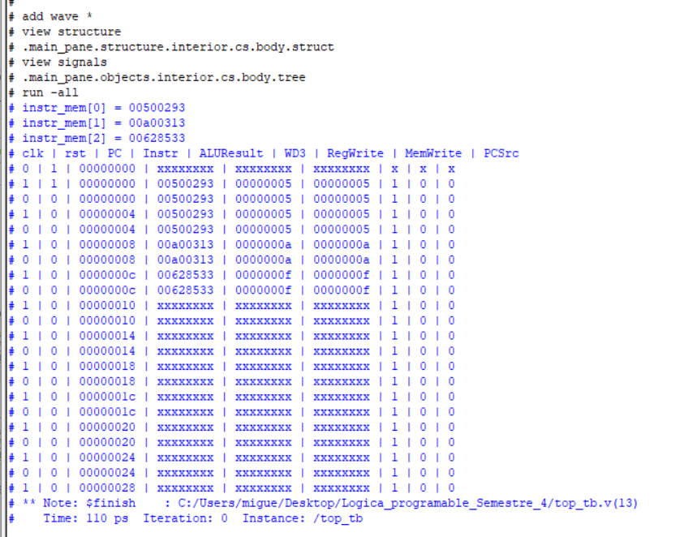

Miguel Alonso De La Rosa Zamora A01646106

# Implementación de un procesador RISC-V single cycle

## Objetivo
  - Implementar una arquitectura de procesador RISC-V con diseño de ciclo único (single-cycle) en Verilog, integrando todos los bloques funcionales necesarios, verificando su comportamiento mediante simulación y analizando su funcionamiento instrucción por instrucción.

## Requerimientos Necesarios:
  - Software Intel Quartus Prime Lite
  - Código en Verilog
  - Conocimiento básicos de arquitectura de computadores
  - Familiaridad con el conjunto de instrucciones RISC-V RV32I
  - Conocimientos en diseño digital con Verilog

## Desarrollo de la Práctica:
1. Definir entradas:
     - Entradas: Reset.
     - Reloj: CLK.

Subir al repositorio donde se encuentran los archivos .v de los módulos, su testbench, y las imágenes necesarias para comprobar el óptimo funcionamiento del sistema. 

## Descripción de los módulos:
El módulo ProgramCounter mantiene la dirección de la instrucción actual. 

El módulo InstructionMemory es la memoria ROM que almacena el conjunto de instrucciones del programa. 

El módulo RegisterFile es un banco de registros (32 registros de 32 bits), con dos lecturas y una escritura. 

El módulo extend extrae e interpreta los campos inmediatos según el tipo de instrucción (I, S, B...).

El módulo ALUControl genera una señal de operación de la ALU a partir de la instrucción.

El módulo ALU es la Unidad Lógica-Aritmética que ejecuta operaciones según la instrucción.

El módulo mainDecoder genera las señales de control globales según el opcode. 

El módulo memory_RAM es la memoria RAM para operaciones de carga/almacenamiento. 

El módulo multiplexor permite seleccionar entradas hacia la ALU o direcciones. 

El módulo sumador es donde se hace la suma de direcciones para el cálculo del siguiente PC. 

El módulo BranchComparator compara registros para instrucciones de salto condicional. 

## Testbench:
Se desarrolló un testbench para verificar el módulo 'top.v', aplicando los ciclos de reloj para que pueda empezar a ejecutar las instrucciones del archivo instrMem.hex, y así observar los resultados. 
## Diagrama RTL:
El siguiente diagrama muestra la implementación lógica generada por Quartus a partir del código Verilog del módulo top. 

## Waveform: 
A continuación se observa la simulación temporal del circuito, donde se verifica el comportamiento correcto del single cycle:

